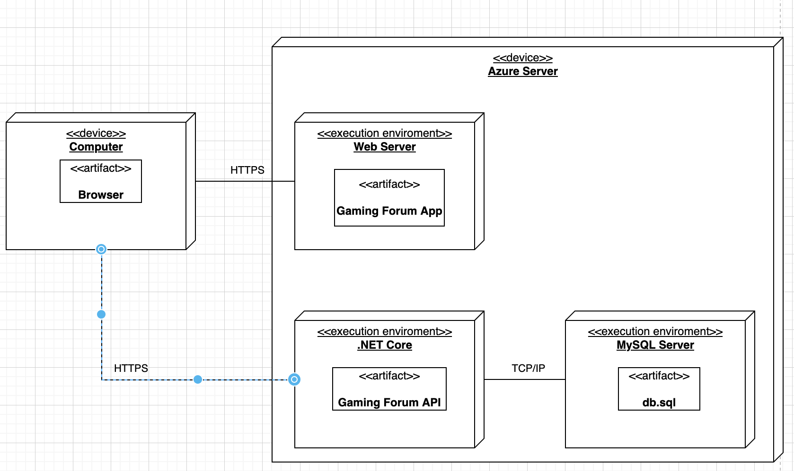

# Gaming Forum

## 1. Sprendžiamo uždavinio aprašymas

### 1.1 Sistemos paskirtis

Projekto tikslas - sukurti vietą, kur žmonės galėtų diskutuoti apie žaidimus.

Veikimo principas – pačią kuriamą platformą sudaro dvi dalys: internetinė aplikacija, kuria
naudosis svečiai, vartotojai, administratorius bei aplikacijų programavimo sąsaja (angl. trump. API).

Svečias atėjęs į svetainę galės naršyti per svetainę ir matyti kitų vartotojų sukurtą turinį. Norint kurti įrašus ar komentarus, svečias turės prisiregistruoti ir tada galės kurti diskusijas, kuriant įrašus arba rašant komentarus po įrašais. Taip pat, jeigu vartotojui patinka kito vartotojo įdėja, jis gali palikti patiktuką po jo įrašu ar komentaru. Administratoriai moderuos svetaine, kur galės ištrinti taisykles pažeidžiančius įrašus ar komentarus, o jeigu ir labai prireikus - užblokuoti patį vartotoją.

### 1.2 Funkciniai reikalavimai

Svečias galės:

1. Peržiūrėti kategorijų sąrašą.
2. Peržiūrėti įrašų pavadinimų sąrašą.
3. Peržiūrėti specifinį įrašą.
4. Matyti komentarus po įrašu.
5. Užsiregistruoti
6. Prisijungti

Prisijungęs vartotojas galės:

1. Kurti naują įrašą.
2. Modifikuoti savo įrašus.
3. Ištrinti savo įrašus.
4. Palikti patiktuką ant įrašo.
5. Kurti komentarą.
6. Modifikuoti savo komentarą.
7. Ištrinti savo komentarą.
8. Palikti patiktuką ant komentaro
9. Atsijungti

Administratorius galės:

1. Kurti naują kategoriją.
2. Modifikuoti kategorijas.
3. Ištrinti kategorijas.
4. Ištrinti kito vartotojo įrašą.
5. Ištrinti kito vartotojo komentarą.
6. Blokuoti vartotoją.

## 2. Sistemos architektūra

Sistemos sudedamosios dalys:

- Kliento pusė (ang. Front-End) – naudojant React.js;
- Serverio pusė (angl. Back-End) – naudojant ASP.NET Core. Duomenų bazė – MySQL.

Žemiau pavaizduota kuriamos sistemos diegimo diagrama. Sistemos talpinimui yra
naudojamas Azure serveris. Kiekviena sistemos dalis yra diegiama tame pačiame serveryje.
Internetinė aplikacija yra pasiekiama per HTTP protokolą. Šios sistemos veikimui (pvz.,
duomenų manipuliavimui su duomenų baze) yra reikalingas Gaming Forum API, kuris pasiekiamas
per aplikacijų programavimo sąsają. Pats Gaming Forum API vykdo duomenų mainus su duomenų
baze - tam naudojama ORM sąsaja.

## 3. Svetaine

### 3.1 Api

Svetaines API pasiekiamas is:
<a href="https://forumgaming.azurewebsites.net/index.html">SWAGGER</a>
